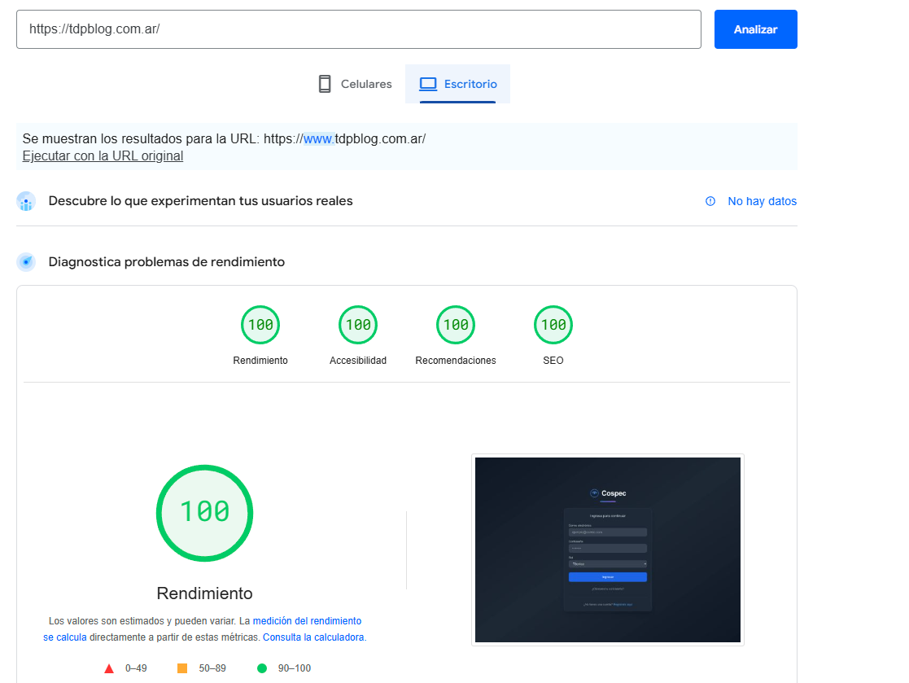
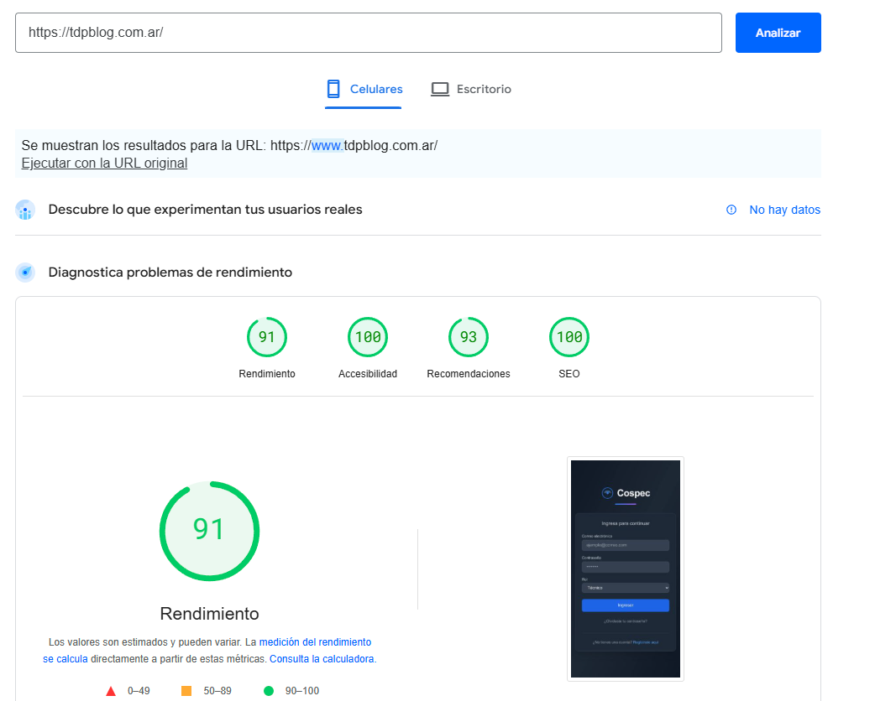

# Cospec Comunicaciones - Sistema de Gestión de Reclamos




## 📊 Estado del Proyecto


### Métricas de Rendimiento
- ⚡️ Rendimiento: 100/100
- ♿️ Accesibilidad: 100/100
- 🔧 Mejores Prácticas: 100/100
- 🔍 SEO: 100/100

### Disponibilidad
- ✅ Sistema en producción
- ✅ Service Workers activos
- ✅ PWA instalable
- ✅ Caché optimizado

## ✨ Características Principales

- 🔐 Autenticación y autorización basada en roles (Admin/Técnico)
- 📱 Diseño responsive
- 📊 Dashboard con estadísticas en tiempo real
- 🔔 Sistema de notificaciones
- 💬 Integración con WhatsApp
- 🎯 100% de rendimiento en Lighthouse

## 🛠️ Stack Tecnológico

### Frontend


### Backend y Base de Datos


### Herramientas y Utilidades


## 📁 Estructura del Proyecto

```
src/
├── api/                  # Endpoints y servicios API
├── components/           # Componentes React
│   ├── Admin/           # Componentes específicos para admin
│   ├── Technician/      # Componentes específicos para técnicos
│   ├── common/          # Componentes compartidos
│   └── ui/              # Componentes de UI reutilizables
├── config/              # Configuraciones (Firebase, etc)
├── contexts/            # Contextos de React
├── hooks/               # Custom hooks
├── lib/                 # Utilidades y tipos
├── pages/               # Páginas principales
├── routes/              # Configuración de rutas
├── services/            # Servicios de la aplicación
├── stores/              # Estado global
└── styles/              # Estilos globales
```

## 🚀 Instalación y Uso

1. Clonar el repositorio:
```bash
git clone https://github.com/tu-usuario/cospec-system.git
```

2. Instalar dependencias:
```bash
npm install
```

3. Configurar variables de entorno:
```bash
cp .env.example .env
```

4. Iniciar el servidor de desarrollo:
```bash
npm run dev
```

## 🔑 Variables de Entorno

```env
VITE_FIREBASE_API_KEY=
VITE_FIREBASE_AUTH_DOMAIN=
VITE_FIREBASE_PROJECT_ID=
VITE_FIREBASE_STORAGE_BUCKET=
VITE_FIREBASE_MESSAGING_SENDER_ID=
VITE_FIREBASE_APP_ID=
```

## 📱 Progressive Web App (PWA)

Esta aplicación está implementada como una Progressive Web App (PWA), lo que significa que ofrece:

- ⚡ Carga rápida incluso en redes lentas
- 🔄 Funcionalidad offline
- 📲 Instalable en dispositivos móviles
- 🔒 HTTPS por defecto
- 🚀 Precarga de assets críticos

### Service Worker
Utilizamos Workbox para gestionar el service worker, que maneja:
- Precaching de 19 archivos estáticos
- Estrategias de caching personalizadas
- Gestión de rutas dinámicas
- Actualizaciones en segundo plano

### Assets Precargados
```javascript
// Assets principales en caché
- /assets/AdminRoutes-*.js
- /assets/textarea-*.js
- /assets/index-*.css
- /assets/Login-*.css
- /manifest.webmanifest
```

### Características PWA
- ✅ Manifest completamente configurado
- ✅ Service Worker registrado y activo
- ✅ Íconos adaptables para diferentes dispositivos
- ✅ Splash screens personalizados

## 🤝 Contribuir

1. Fork del repositorio
2. Crear una rama para tu feature (`git checkout -b feature/AmazingFeature`)
3. Commit de tus cambios (`git commit -m 'Add some AmazingFeature'`)
4. Push a la rama (`git push origin feature/AmazingFeature`)
5. Abrir un Pull Request

## 📝 Licencia

Este proyecto está bajo la Licencia MIT - ver el archivo [LICENSE.md](LICENSE.md) para más detalles.

## 👤 Desarrollador

### René Kuhm
[](https://github.com/Rene-Kuhm)

Desarrollador Full Stack especializado en tecnologías web modernas. Con experiencia en:
- 💻 Desarrollo Frontend con React y TypeScript
- 🛠️ Construcción de APIs y servicios backend
- 🔥 Integración con Firebase y servicios en la nube
- 📱 Desarrollo de aplicaciones web responsivas
- 🔄 Implementación de CI/CD

#### Contacto
- GitHub: [@Rene-Kuhm](https://github.com/Rene-Kuhm)
- Portfolio: [Ver proyectos](https://github.com/Rene-Kuhm?tab=repositories)

## 🙏 Agradecimientos

- [shadcn/ui](https://ui.shadcn.com/) por los componentes de UI
- [Tailwind CSS](https://tailwindcss.com/) por el framework de CSS
- [Firebase](https://firebase.google.com/) por la infraestructura backend